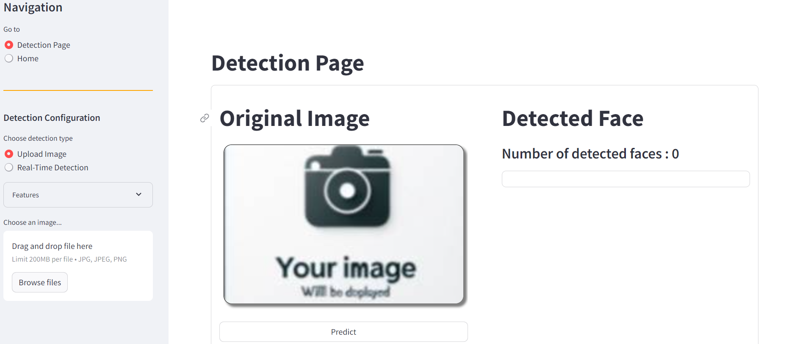

# Face-Sight

## Introduction

This is a real-time face detection app that uses the YOLOv7 model trained on a custom dataset. Given an image or a video stream, the app can detect faces and apply various transformations in real-time such as counting the number of faces, blurring faces, replacing faces with another image, and highlighting faces.



## Features

- **Real-Time Face Detection**: Detects faces in an image or a video stream using the YOLOv7 model.
- **Real-Time Face Count**: Counts the number of faces in real-time.
- **Real-Time Face Blur**: Blurs the faces in real-time for privacy protection.
- **Real-Time Face Pixelation**: Pixelates the faces in real-time for privacy protection.
- **Real-Time Face Replacement**: Replaces the faces in real-time with another image.
- **Real-Time Face Highlight**: Highlights the faces in real-time.

## Installation

Follow these steps to get the Face Detection App up and running:

1. **Clone the Repository**:

```bash
git clone https://github.com/yourusername/your-repo-name.git
```

2. **Set Up a Virtual Environment** (Optional but Recommended)

```bash
python -m venv env
```

3. **Activate the Virtual Environment**:

- On Windows:

  ```bash
  .\env\Scripts\activate
  ```

- On Unix or MacOS:

  ```bash
  source env/bin/activate
  ```

4. **Run the config.py file**: Run the script file to install the YOLOv7 model:

```bash
python config.py
```

## Usage

To run the app using Streamlit:

- On Windows:

  ```bash
  streamlit run app.py
  ```

- On Unix or MacOS:

  ```bash
  streamlit run app.py
  ```

Then, open your web browser and go to http://localhost:8501 to view the app.

## Acknowledgements

This project uses the YOLOv7 repo for face detection. You can find the original YOLOv7 repository here.

## License

This project is licensed under the [insert your license here]. See the `LICENSE` file for details.
